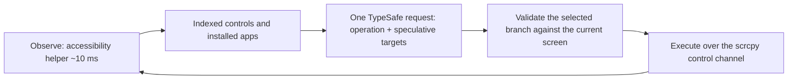

# scrcpy-jev

**One goal. A real Android phone over USB. Jev makes the decisions; scrcpy and ADB execute them.**

A local reimplementation of the [mobile-jev](https://github.com/droidrun/mobile-jev) concept with
no cloud device service in the loop: the same idea, the same studio layout and the same Jev policy
shape, but the phone is plugged into your machine instead of reached through a vendor API.

> **Origin.** This project is derived from **[droidrun/mobile-jev](https://github.com/droidrun/mobile-jev)**
> (MIT). The policy questions sent to the model, the candidate/validation/execution split, the
> stale-decision rules, the studio layout and parts of the test suite are adapted from it. What
> changed is the device layer: ADB and scrcpy instead of the Mobilerun cloud API. See
> [Credits](#credits).

- No device API keys, no per-minute device billing, no round trip through a vendor.
- **~10 ms observations** instead of ~2.7 s (the cost of one `uiautomator dump`).
- A studio, a CLI, execution traces, and offline tests — the same shape as mobile-jev.

## Why it is fast

| Step                  | mobile-jev (Mobilerun cloud) | scrcpy-jev (local)       |
| --------------------- | ---------------------------- | ------------------------ |
| Read the screen       | HTTP round trip to the cloud | **~10 ms** via helper    |
| Inject a tap          | HTTP round trip              | scrcpy control channel   |
| Live view             | vendor `DeviceStream`        | scrcpy H.264 + WebCodecs |
| Model call (TypeSafe) | ~1 network round trip        | unchanged                |

`uiautomator dump` takes about 2.7 s per call because each invocation boots a fresh JVM and
reconnects the accessibility bridge. `src/device/helper/JevServer.java` connects **once**, then
answers framed JSON requests over an ADB abstract socket. Measured on a Xiaomi M2011K2G (Android 13):

```
first observation   434 ms   (JIT + first accessibility sync)
warm observations    16 ms   (steady state)
```

## Requirements

- **Node.js 22.16+** (24 recommended)
- **adb** from platform-tools, with the device authorised for USB debugging
- **scrcpy 1.16+** installed locally — its own `scrcpy-server` jar is pushed to the device, so the
  protocol version always matches
- **JDK 8+ and Android SDK build-tools** to compile the on-device helper (built automatically on the
  first run; `npm run helper` rebuilds it)
- A **TypeSafe API key** to run tasks ([console.typesafe.ai](https://console.typesafe.ai/))

## Run it

```sh
npm install
cp .env.example .env.local     # add TYPESAFE_API_KEY
npm run doctor                 # checks adb, scrcpy, the helper and credentials
npm run dev                    # opens http://127.0.0.1:3050 in your browser
```

`npm run dev` opens the studio once the server is actually listening, which is after the scrcpy
session is up. Set `STUDIO_OPEN=0` to keep it manual; `npm start` never opens a browser.

Enter a goal and press **Run task**. The device view is interactive: click to tap, drag to swipe,
scroll to scroll, and type on your keyboard when the phone screen has focus. While a task is
running, the agent owns the device and manual input is rejected.

Every step in **Live activity** has an expand control that opens its record:

- **Input** — the exact model request: the goal, the foreground app, the focused field, every
  control offered with its labels and available operations, the question set, the installed apps
  that were offered, and the visible text.
- **Output** — the model's answer with its probability distribution per question, the confidence,
  the model name, the latency and the token usage.
- **Execution** — the action that was sent, the resolved coordinates or clipboard method, the
  observation before and after (foreground app, element count, fingerprint) and whether the screen
  changed.
- Raw JSON for the request, the response and the action, for anything the summary omits.

The records stay on the server (capped, dropped oldest first) and are fetched when a step is
expanded, so the live feed stays small even for a 50-step run. Terminal decisions — `DONE`,
`BLOCKED`, `needs_input` — get a row too, so a run that stopped without acting can still be
inspected.

### When a run needs a value

Jev selects text from the goal; it never invents a field value. If a focused field needs something
the goal does not contain, the run stops with **Needs attention** and leaves the phone on that
screen instead of guessing. Supply the value explicitly — `--text "value"` on the CLI — or write it
verbatim in the goal, where it becomes a span Jev can select.

## Use the CLI

```sh
# Preview the next decision without executing it:
npm run agent run "Turn on dark theme in Android Settings."

# Execute a goal and keep a real trace:
npm run agent run "Turn on dark theme in Android Settings." \
  --execute --steps 20 --trace artifacts/dark-theme.jsonl

# Inspect the phone or drive it directly:
npm run agent observe
npm run agent screenshot --out artifacts/screen.png
npm run agent tap 399 871
npm run agent type "dark theme" --clear
npm run agent open com.android.settings
npm run agent home
npm run devices
```

`npm run agent --help` lists every option. `--device SERIAL` (or `ANDROID_SERIAL`) picks a phone
when several are attached.

## How Jev drives it



Jev chooses `OPEN_APP`, `TAP`, `TYPE_TEXT`, scrolling, navigation, `WAIT`, `DONE` or `BLOCKED`.
Operation and target questions share one request; an unused speculative target can never execute.
Action candidates are derived from the observed tree, coordinates are re-resolved from the current
geometry, stale decisions are rejected before any input is sent, and an uncertain mutation is never
replayed automatically.

Text comes from exact spans in the goal. Jev selects a span; code copies it into the field. Supply
`--text "exact value"` to override the candidates. Typing is verified locally: after a replacement,
the agent re-reads the field and requires the complete value before continuing. Non-ASCII text is
pasted through scrcpy's clipboard message, which keeps IME-hostile input intact.

**Jev's `DONE` response is not independent proof of success.** Check the resulting screen, especially
for numeric values, dates and multi-part goals.

## Layout

| Path                 | Purpose                                                         |
| -------------------- | --------------------------------------------------------------- |
| `src/device/helper/` | The on-device Java helper (compiled to a dex jar)               |
| `src/device/`        | ADB, helper client, scrcpy session, observation, device adapter |
| `src/agent/`         | Candidates, TypeSafe policy, executor loop, input verification  |
| `src/server/`        | Studio HTTP/SSE/WebSocket server, video fan-out, run store      |
| `src/cli/`           | Command line                                                    |
| `web/`               | The studio: plain HTML/CSS/JS, no build step                    |
| `test/`              | Offline tests (no phone, no network)                            |
| `artifacts/`         | Local-only traces and screenshots                               |

## Design notes

- **One scrcpy session.** The studio, the agent and the CLI share a single video/control session.
  Control messages are serialised, so a human gesture can never interleave with an agent gesture.
- **Late viewers still see video.** scrcpy sends its SPS/PPS once and only the encoder decides when
  the next IDR appears, so the video hub caches the current group of pictures and replays it to each
  new client.
- **Browsers without WebCodecs** fall back to polling `GET /api/snapshot` at ~4 fps.
- **App labels are heuristic.** Android exposes launcher-visible packages but not their labels, so a
  seed map covers common apps and everything else is humanised from the package name. The package
  name is always offered to the model as well.
- **The studio binds to localhost** and validates `Host` and `Origin` on every request. API keys stay
  on the server; the browser only ever talks to this process.

## Credits

This project is a fork of, and stands on, other people's work:

- **[droidrun/mobile-jev](https://github.com/droidrun/mobile-jev)** — the original concept and the
  source this project was forked from. The TypeSafe question shape, the split between "the model
  picks an operation and a target" and "the code owns candidates, validation and execution", the
  stale-decision rule, the studio's layout and a good part of the test suite come from it. Thank
  you for publishing it under MIT.
- **[Jev](https://docs.typesafe.ai/)** by [TypeSafe](https://typesafe.ai/) — the decision engine.
  One request per step returns a calibrated distribution over operations and speculative targets;
  the whole design of the loop follows from that contract.
- **[scrcpy](https://github.com/Genymobile/scrcpy)** by Romain Vimont and contributors — the H.264
  video stream, the control protocol and the server jar this project pushes to the phone. Every tap,
  swipe, key and paste in this repository goes through scrcpy's control channel.
- **[ya-webadb / scrcpy-ts](https://github.com/yume-chan/ya-webadb)** — the TypeScript ADB client and
  scrcpy protocol implementation (`@yume-chan/adb`, `@yume-chan/scrcpy`) that lets Node talk to the
  device directly instead of shelling out to `adb` for every command.
- **[Mobilerun](https://mobilerun.ai)** — the cloud device API mobile-jev is built on. This
  project's device adapter deliberately mirrors its `observe` / `act` / `list-apps` surface so the
  policy and executor ported over unchanged.
- Typefaces **DM Sans** and **IBM Plex Mono**; every icon is hand-written SVG.

## Development

```sh
npm test        # offline test suite (no phone, no network)
npm run check   # tests and formatting
npm run helper  # rebuild the on-device helper jar
```

Two scripts drive the studio in headless Chrome over the DevTools protocol, which is how the video
pipeline was debugged. Start Chrome with `--headless=new --remote-debugging-port=9222` first.

```sh
node scripts/cdp-inspect.mjs http://127.0.0.1:3050        # state + console + screenshot
node scripts/cdp-probe.mjs   http://127.0.0.1:3050 9000   # instrument WebSocket/VideoDecoder
```

Live runs control a real phone and make real TypeSafe requests. Tests never do either. To exercise
the whole loop without spending model quota, point the policy at a local stub:

```sh
TYPESAFE_BASE_URL=http://127.0.0.1:8787/v1/systemone TYPESAFE_API_KEY=stub npm start
```

MIT licensed, like the project it was forked from; dependencies and the scrcpy server retain their
respective licences.
